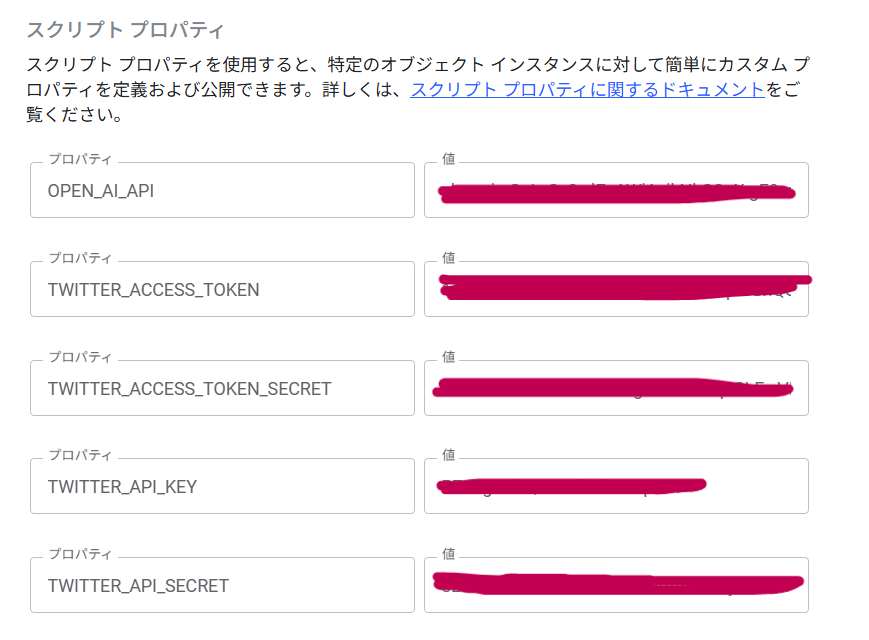

# X-Bot

[English](./docs/lang/en.md) | 日本語

このプロジェクトは **Google Apps Script (GAS)** を[clasp](https://github.com/google/clasp)で管理している。  

## 機能紹介

以下の機能は、GASのトリガーを使うことで定期投稿が可能になる

### 機能1: 短い奇妙な話を生成し、Xにポストする

batchPostStrangeStory関数を実行し、AIが生成した奇妙な話をハッシュタグと共にXにポストする
例:
```
古びた屋敷の廊下を歩くと、壁の絵から見知らぬ子供がこちらをじっと見つめていた。目を逸らし、再びその絵に視線を戻すと、その子供は二人に増えていた。不安になり走り出す僕の耳に、「一緒に遊ぼうよ」と悲しげな声が追いかける。屋敷から飛び出すと、足下には見慣れぬ足跡が並んでいた。翌朝、その屋敷は跡形もなく、ただ子供たちの笑い声が風に乗って、僕の背中を優しく押した。

#奇妙な話 #フィクション
```

### 機能2: 存在しない言葉・ことわざを生成し、Xにポストする

batchPostDontExistWords関数を実行し、AIが生成した存在しない言葉・ことわざをハッシュタグと共にXにポストする
例:
```
かびの餅が語る

■意味
時間を忘れて悠久の間放置された問題が、勝手に解決することを表すことわざです。

ある村に古くから祭られた餅がありましたが、その餅は忘れ去られ、長い年月でかびに覆われました。ある日、不思議な夢を見た村人がその餅を眺めに行くと、カビは神聖な模様となり、村の謎を解き明かす鍵となったのです。その現象に村人は驚き、時に問題も放っておけば勝手に解決することもあると感じました。

#フィクション
```

## 必要環境

- Node.js（v16 以上推奨）  
- npm または pnpm  
- [clasp CLI](https://github.com/google/clasp)  
- Google アカウント  

## セットアップ手順

1. **リポジトリを取得**  

    ```bash
    git clone <リポジトリURL>
    cd X-Bot
    ```

2. **依存パッケージをインストール**

    ```bash
    npm install
    # または pnpm install
    ```

3. **claspをインストール（未導入なら）**

    ```bash
    npm install -g @google/clasp
    ```

4. **Googleアカウントでログイン**

    ```bash
    clasp login
    ```

    * ブラウザが開くので、使用したいGoogleアカウントで認証する
    * 認証情報は`~/.clasprc.json`に保存される

5. **GASプロジェクトを作成**

   * [Google Apps Script](https://script.google.com/) にアクセスし、「新しいプロジェクト」を作成する
   * メニューの **「プロジェクトの設定」** → 「Script ID」をコピーする

6. **GASプロジェクトをローカルに関連付け**

    ```bash
    clasp clone <コピーしたScript ID>
    ```

   * `.clasp.json`が生成される
   * 以降、ローカルとGASが同期可能になる

7. **ファイルを同期**

   * GAS → ローカル

       ```bash
       clasp pull
       ```

   * ローカル → GAS

       ```bash
       clasp push
       ```

8. **スクリプトプロパティの設定**
    * XのDeveloper Portalから以下を作成する
      * [作成手順](https://qiita.com/neru-dev/items/857cc27fd69411496388)
        ```
        # アクセストークン
        TWITTER_ACCESS_TOKEN
        # アクセストークンシークレット
        TWITTER_ACCESS_TOKEN_SECRET
        # APIキー
        TWITTER_API_KEY
        # APIシークレット
        TWITTER_API_SECRET
        ```
    * OpenAIからAPIを発行
        ```
        # OpenAIのAPI
        OPEN_AI_API
        ```
    * 完成例
        
